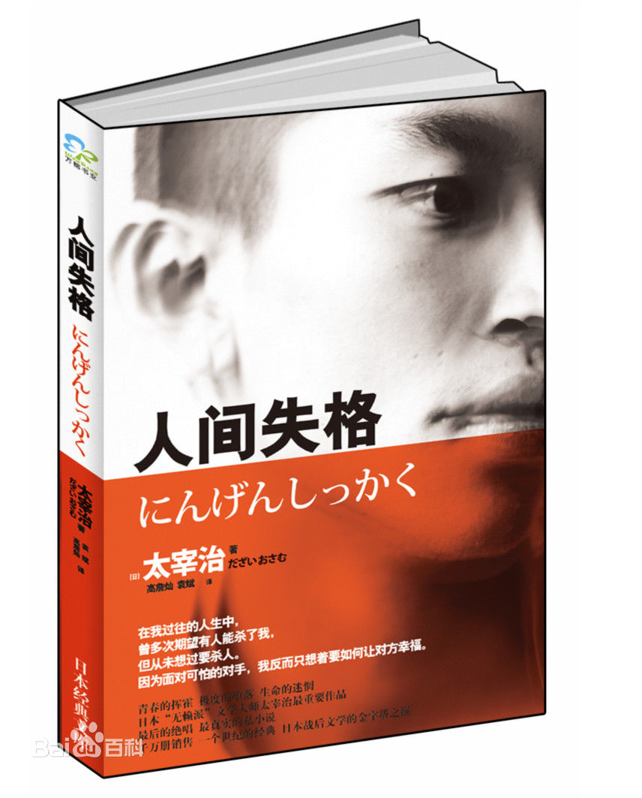

  
  作为日本无赖派小说家太宰治的代表作，《人间失格》透露出极致的颓废气息——失去在人间做人的资格。
  主角叶庭对生活充满了恐惧和不安，为了逃避现实而选择自我沉沦，从封闭内心玩世不恭，到酗酒、自杀、用药物麻痹自己，最后一步步走向自我毁灭的道路。用常人的眼光来看，他就是一个无赖,但是用心体会，他其实也是一个“像神一般纯正的孩子”，他能洞察人类的虚伪和迷失，只是发现这个真相之后，发现自己无力改变现状，自己便也也迷失了。但自我放逐我是不欣赏的，因为人任何时候都不能放弃自己！

>真正的勇士，是发现生活本质之后仍然能够用心热爱这个世界的人！
>向生活致敬！
>向勇士致敬！
  哈哈，我要做这样的勇士\~
  生活你服不服！
